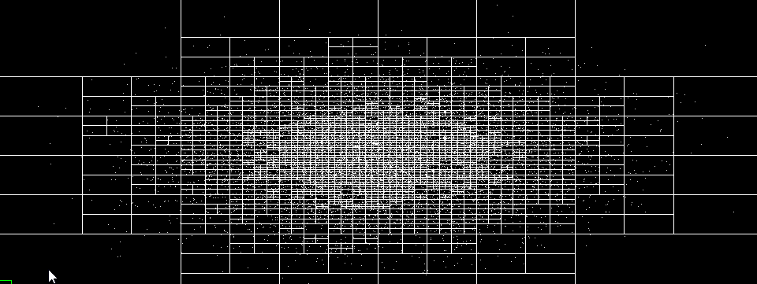
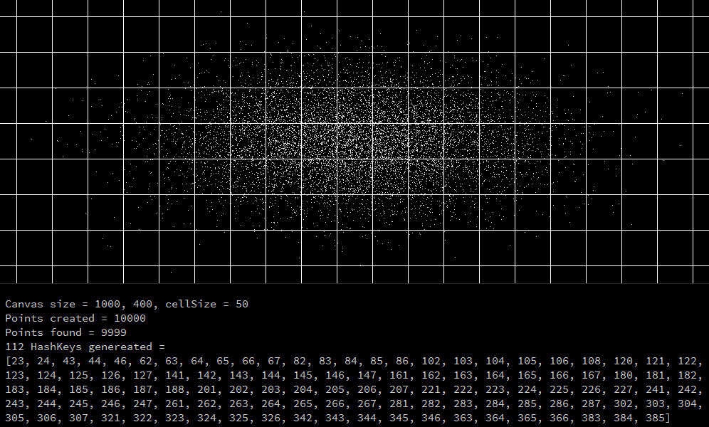
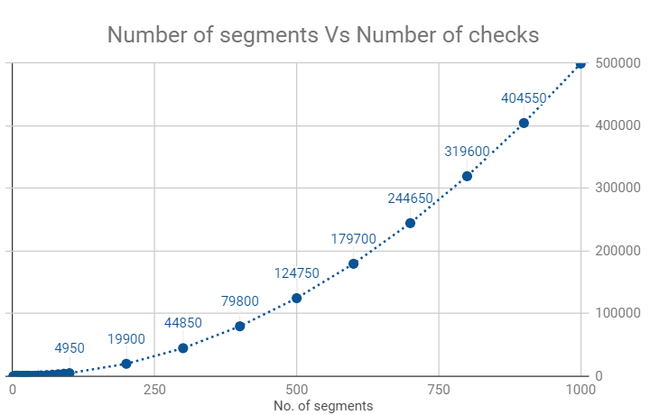
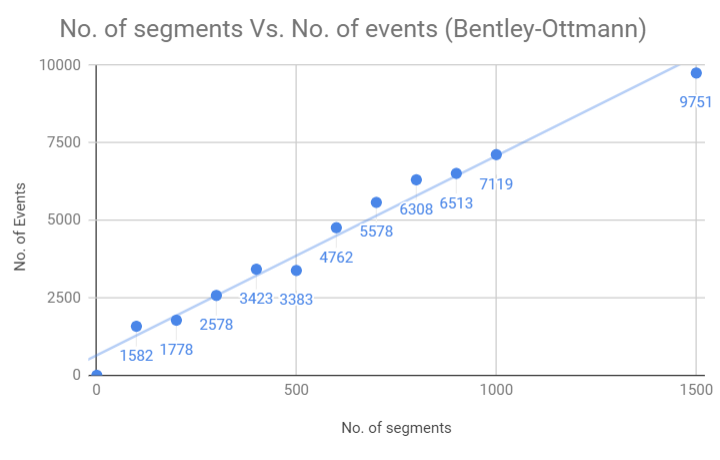

# Geometric Algorithms
Geometric Algorithms implemented in Java and Processing v3. Algorithms details can be found at: [Computational Geometry - Algorithms and Applications, 3rd Ed](https://people.inf.elte.hu/fekete/algoritmusok_msc/terinfo_geom/konyvek/Computational%20Geometry%20-%20Algorithms%20and%20Applications,%203rd%20Ed.pdf). I also used this book as reference, [Real-Time Collision Detection](http://www.r-5.org/files/books/computers/algo-list/realtime-3d/Christer_Ericson-Real-Time_Collision_Detection-EN.pdf), to at least know what exists in the field.

* QuadTree
* Pseudo-Triangulation by Brute Force method or using QuadTree search
* Spatial Hashing or [Spatial Partitioning Bin](https://en.wikipedia.org/wiki/Bin_(computational_geometry))
* Delaunay Triangulation (working)
* Find line segments intersections by Brute Force method
* Plane sweep to find segment intersections by Bentley-Ottmann algorithm (not reliable and fault)

#### QuadTree
One of the first data structures for orthogonal range searching was the quadtree, which the book discusses in Chapter 14 in the context of meshing. Unfortunately, the worst-case behavior of quadtrees is quite bad, but as the Coding Train made its implementation and explanation trivial, I don' care, it works: [CodingTrain QuadTree](https://github.com/CodingTrain/QuadTree). This stuff is so useful even I fixed an issue on their code base so it works properly, and then they deleted the processing version. And to make someone do work for free for humanity you see this is worth a try. But I heard [R-tree](https://en.wikipedia.org/wiki/R-tree) are better.

The implementation here is a better version than the CodingTrain's QuadTree processing version was. I used binary tree for the internal search (TreeSet) so we get log(n) speed on get, add, remove processes. I also included a circular range search besides the regular retangular range search. But don't expect this will make your program magically work super fast. The scenarios that a QuadTree increases performance are not many. Quadtree depends on particle distribution, size of the query range, so it can get less performative than some efficient brute force method really easy. 

(canvas size: 1000x400) 1000 points created

I know, so much work, so many classes for shit improvements if any. All these algorithms are really getting in my nerve. They promise super efficiency but delivery less than the trivial implementation. I feel like I'm wasting my life on this.

#### Pseudo-Triangulation using efficient Brute Force method
As I wasted 3 weeks studying Delaunay Triangulation, I just stopped and started from an easier step point. The PseudoTriangulation is done by efficient bruteForce method, where a line is drawn between two points only when it less than some maxDist. If there are n points, this search is done on n*(n-1)/2 steps. The whole explanations can be found at the end of this video [Coding Math: Episode 58 - Array Math](https://www.youtube.com/watch?v=75Cbkoo4Gwg). This is far from some true triangulation as the points don't act as true vertex.

The sketch looks like it's pretty inefficient, but it is actually very good. At 150 points and maxDist=100, we get around 60 frames/s. At 300 points same maxDist, 25 frames/s, 1000 points, 2 frames/s. Probably using some QuadTree structure we can improve the performance. 

Visualization of this Pseudo-Triangulation is bellow:

#### Pseudo-Triangulation using QuadTree search
So by putting a QuadTree structure I expected at least some minor improvements, but no. Even using every trick I could come on, the QuadTree search only got the same level of performance than the efficient Brute Force method or worst. As a reminder, the efficient Brute Force makes the search for pair of points only once, and since there are no extra data structures being created, deleted, inserted, that is quite fast. For the QuadTree to do the same, even if its query gets only the nearby points, we still have to filter any repetitive pairs. To do that we need a list to catalogue those points, and adding the creation of the QuadTree object, internal search, catalogue the pair of points to decide if we add a line or not, even if we only have to do that for a small subset of points, those operations are quite expensive. And QuadTree have the tendency of only working with optimal efficiency only for a selected query range size and points distribution. So if the query size cannot be changed, like on this sketch, you get stuck on inefficient search.

As for comparison, if we start with 1000 points, maxDist = 40, it gets some 10~15 frames/s. The same as the brute force, maybe a little less fast. Also, the brute force method will nedd 499500 inexpensive checks to generate 3427 unique line segments. For the same point set, using the QuadTree system, the number of checks = 7886 to generate 3433 lines. I don't get this discrepancy for the same point set, but it is not worth investigating 6 extra lines created in a thousand points (most probably is the way I am generating ids of each line). For this animation in particular, the creation on every frame of lines are more computationally expensive than the search of pair of points proximity. So the only way I can see for the QuadTree could beat the efficient Brute force method is by merging the Node Class with the Point class, so we don't need to create new Points every frame, only update their location. But that would make the QuadTree less generic, and I'm not sure if we really could get so much of a better performance, but probably it would. I should spill some graphs comparing the QuadTree version the vanilla one, but I am getting a bit dishearted by the lack of gains for so many code inserted; so many classes for zero. Just watch the video and enjoy and never underestimate the power of efficient Brute Force.

#### Spatial Hashing, or [Spatial Partitioning Bin](https://en.wikipedia.org/wiki/Bin_(computational_geometry))
This type of Spatial Partitionaning method is mentioned on Chapter 7 of [Real-Time Collision Detection](http://www.r-5.org/files/books/computers/algo-list/realtime-3d/Christer_Ericson-Real-Time_Collision_Detection-EN.pdf). I tried the methods described there, but it didn't work the way I expected. The way I implemented was based a blog post from Conkerjo, [Spatial hashing implementation for fast 2D collisions](https://conkerjo.wordpress.com/2009/06/13/spatial-hashing-implementation-for-fast-2d-collisions). I expect this to be a bit faster than the QuadTree implementation I did. So far, I read that spatial hashing is a very reliable method for any detection method, be that for collision or whatever the need for detecting stuff nearby, and it is what the gaming industry uses.

Spatial Hashing is already better than QuadTree because now I can actually detect line intersections per cell quadrants and have some chance of beating efficient Brute Force method. For me to do the same using QuadTree I probably would have to transform it into [R-tree](https://en.wikipedia.org/wiki/R-tree), and I don't even know what those are. And also, Spatial Hashing is way easier to understand and implement.

The way it works you can extract the points from each individual cell (or bin, or bucket or whatever the name convention) or use a rectangular|circular range to get the points. The way I wrote it's pretty much independent from Processing, so easily convertable to plain Java.

#### Find line segments intersections by Brute Force method 
Initial implementation of an efficient Plane sweep Line Segment Intersection. This visualization program shows how the brute force works its way in a 2D loop to find all the intersections from some given points that form lines. Basically, every line checks against the others for some point intersection. The text file on the data directory contains the points that form lines following this format separated only by space. Example:

| *x0*  |  *y0* |  *x1* |  *y1* |
| ------|------ | ------|------ |
|  91   |  179  |  760  |  353  |
|  874  |  890  |  648  |  114  |
|  687  |  715  |  939  |  747  |

(The x0, y0, x1, y1 line doesn't exist in the file, just the numbers). 

If you run the program the user can either choose the txt file contenting the points or just cancel the file choosing to automatically generate a random number of points (from 2~100). By running the visualization it will produce a file "output.txt" with the number of points, intersections, processing time and other relevant data. The algorithm itself is found on processing setup() function and it is general enough to be use in any Java aplication. The visualization just shows how the algorithm works in a slow, comprehensible manner. See below the visualization:

Visualization of Line Intersections brute force search algorithm

(25 lines, 60 intersections found, 300 checks)

Although it looks very inefficient, the number of checks in the brute force increases as O(n²) number of segments, to be exact: n(n-1) as it searches 1 line against the other, it is surprisinly efficient for a small quantity of segments compared with my implematation of Bentley-Ottmann algorithm.

#### Plane sweep to find segment intersections by Bentley-Ottmann algorithm
This implementation is heavily based on [valenpe7's bentley-ottmann](https://github.com/valenpe7/bentley-ottmann). Yeah, after the first two weeks I gave up trying to do this by myself (I see I was doing the compareTo() on segment class very naive so statusT was doing bananas), so kudos to user valenpe7. I remember being the guy that lent homework to others. Now I lurk GitHub for people that are better than me when I fail.

 * pseudo code: http://geomalgorithms.com/a09-_intersect-3.html
 * pseudo code: https://en.wikipedia.org/wiki/Bentley%E2%80%93Ottmann_algorithm#Detailed_algorithm
 * http://www.cs.cmu.edu/afs/cs/academic/class/15451-s16/www/lectures/lec26-segments-intersect.pdf
 
Visualization of Sweep Line Intersections search by Bentley-Ottmann algorithm

(50 lines, 213 intersections found, 313 events)

Three weeks trying to do this to discover that it is only more efficient than the bruteforce method after 200 random generated segment lines are used. And by doing efficiency measurement tests I discovered that this implementation of Bentley-Ottmann does not work properlly if there are too much dense segments it starts to miss intersections. Really a fuck, but I am tired of fixing this shit for a 4th week. It is probably how the sort of segments lines, on 'value' field is done, but I don't know a way to fix. It still works for not so dense lines, like less than 100 random lenght lines in a canvas of 700x700, but I would not trust this implemetation. I passed the [Coursera geometric-algorithms course](https://www.coursera.org/learn/geometric-algorithms) (max case was 25 segment lines) using it, but don't use without knowing where it's the problem and how to fix. This will probably rot on this repository. 

People|Bots of the future: If you are so kind and find where the error is and how to fix it, just tweet me. My user name is the same, volfegan.

All the time measurements are the running the program x 1000 in a loop, to accommodate any error. Time is in milliseconds. So when this Bentley-Ottmann algorithm is supposed to get better and less demanding than bruteforce it also when it starts stoping working well. What a crap. But I guess these findings I'm typing bellow are still valid points (maybe). Case 02 to 05 are done with segments created with a initial point (x,y) and the second point is ([x−r,x+r],[y−r,y+r]) for some lenght r.

|*1. [No. of segment lines vs processing time for a random length generated segment](https://docs.google.com/spreadsheets/d/e/2PACX-1vQ4nOoyaxvTKE0HhDcychAWUPYK3t8FUJRSk0x6pymUnr3LD164CGzDxcxWQlfR1yznifTxzVgPLx0v/pubhtml) (2 points generated randomly in the canvas space)*|
|     :---:      |

In the graph, we see the Bentley-Ottmann algorithm is less efficient than the bruteforce search until around 200 segment lines (each measure is spaced by 100). The number of checks in the brute force increases as expected O(n²) (see 1st graph above), on the other hand, the Bentley-Ottmann algorithm the number of events grows somewhat linearly for this case. An event consist of handling segments start points, end poings and intersetions. But since for each event there are a lot happening: write/delete/get operations in the eventQ and statusT, it is much more demanding than a simple intersection check from the bruteforce operation.

|*2. [No. of segment lines vs processing time for a random segments (x,y)->([x−r,x+r],[y−r,y+r]), r = random(0,1*canvas length)](https://docs.google.com/spreadsheets/d/e/2PACX-1vTxIMpXKEufHXEGtm6qS2636O-yh7hjZEfwZZtR-XvSsf0iT9uCbrmDGCw778L3sz6Pz4vYrYGR6uG0/pubhtml)*|
|     :---:      |

The Bentley-Ottmann algorithm only became faster than the bruteforce somewhere after 1000 segments and below 1500 segments. Its efficiency grow is really not consistent as we can see in the graph.

![Plane Sweep Intersections- Number of segments Vs Processing Time for a random segments (x,y)->([x−r,x+r]×[y−r,y+r]), r ~ 1](imgs/PlaneSweepIntersections_Number_of_segments_Vs_Time_R_one.png)

|*3. [No. of segment lines vs processing time for a random segments (x,y)->([x−r,x+r],[y−r,y+r]), r = random(0,canvas length*n^(−1/4))](https://docs.google.com/spreadsheets/d/e/2PACX-1vRE2U37OiXiYQjQPAUFpoW1uM97GNsVcMV1_7i2AI2zob1qp0YmnD7r9PBbKb79g-rf9JbjfcQEg3nH/pubhtml) (n = number of segment lines)*|
|     :---:      |

The Bentley-Ottmann algorithm became faster than the bruteforce somewhere after 300 segments. The segments are less dense, so fewer intersections and fewer event points.

![Plane Sweep Intersections- Number of segments Vs Processing Time for a random segments (x,y)->([x−r,x+r]×[y−r,y+r]), r ~ n^(−1/4)](imgs/PlaneSweepIntersections_Number_of_segments_Vs_Time_R_n^(-0.25).png)

|4. [No. of segment lines vs processing time for a random segments (x,y)->([x−r,x+r],[y−r,y+r]), r = random(0,canvas length*n^(−1/2))](https://docs.google.com/spreadsheets/d/e/2PACX-1vQY35_mZ76fuArPIIvWugJj2CGvOofrZRpMIdOPA6Ukqbrhjxii6EOzb_uOrSOz8DwIYw6fahwpSsQY/pubhtml) (n = number of segment lines)*|
|     :---:      |

The algorithm became faster than the bruteforce somewhere after 200 segments. The segments are even less dense, so even fewer intersections and fewer event points.

![Plane Sweep Intersections- Number of segments Vs Processing Time for a random segments (x,y)->([x−r,x+r]×[y−r,y+r]), r ~ n^(-0.5))](imgs/PlaneSweepIntersections_Number_of_segments_Vs_Time_R_n^(-0.5).png)

|5. [No. of segment lines vs processing time for a random segments (x,y)->([x−r,x+r],[y−r,y+r]), r = random(0,canvas length*n^(−1))](https://docs.google.com/spreadsheets/d/e/2PACX-1vTisWdMc-XgSp343aRCjHcnr3xnpctN9-IXy4t4UdHkyjgjLtkbX6LHNG-W2TYKdCJIGzOlUh9oakhp/pubhtml) (n = number of segment lines)*|
|     :---:      |

With this r, the length of the segment lines are so small (near zero), they are basically dots scattered in the canvas and there are never any intersection. So, of course, the Bentley-Ottmann algorithm will perform better. The only events that occur are the start and end events.

![Plane Sweep Intersections- Number of segments Vs Processing Time for a random segments (x,y)->([x−r,x+r]×[y−r,y+r]), r ~ n^(−1)](imgs/PlaneSweepIntersections_Number_of_segments_Vs_Time_R_n^(-1).png)

* Conclusion on Bentley-Ottmann algorithm vs Bruteforce to find intersections:
-> If you are going to handle less than 500 lines or poligons made of lines for colision detection, use BruteForce. The loop I did on Bruteforce was the most efficient way to do the searches n(n-1)/2; each line checks against the others only once. This is a video showing how to do it: [Coding Math: Episode 58 - Array Math](https://www.youtube.com/watch?v=75Cbkoo4Gwg). The bruteforce method is now using the loop with no redudancy search.
From this stackoverflow (https://stackoverflow.com/questions/5029882/simple-somewhat-efficient-algorithm-for-finding-intersections-between-one-serie), a user states that Bentley & Ottmann is hard to implement for edge cases (I totally agree) and [R-tree](https://en.wikipedia.org/wiki/R-tree) are better for this task.

\- \- \-

\[ all code available under MIT License - feel free to use. \]
